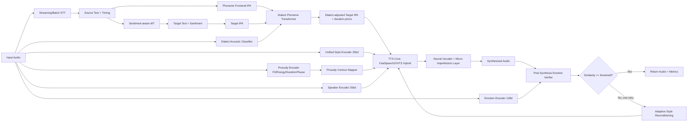
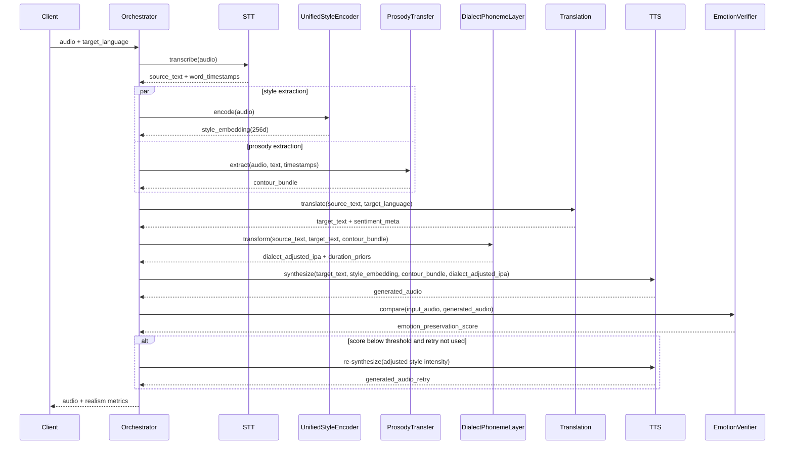

# EPMSSTS v3: Ultra-Realistic Speech Behavior Architecture & 6-Month Implementation Plan

**Status:** Principal Architecture Design (Implementation-Ready)  
**Date:** March 2, 2026  
**Target Users:** Andhra + Telangana daily-life SaaS users  
**Scale:** 100,000 DAU  
**SLA:** <5s non-streaming p99, <800ms partial streaming response  

---

## 1) Scope and Non-Negotiable Constraints

This v3 design extends existing v2 capabilities:
- emotion embedding (128d), dialect embedding (64d), speaker embedding (256d)
- XTTS v2 style conditioning
- emotion-aware translation
- session smoothing
- GPU orchestration

New v3 goal: **ultra-realistic behavioral speech**, with phoneme-accurate dialect authenticity and prosody contour transfer under production SLA and reliability constraints.

**Hard constraints:**
1. No rule-based pitch/speed multipliers as primary mechanism
2. Prosody conditioning must be learned and contour-grounded
3. Dialect authenticity must be phoneme-level and measurable
4. Maintain <5s end-to-end non-streaming SLA
5. Maintain 100k DAU production scalability

---

## 2) Updated End-to-End Architecture Diagram



---

## 3) Data Flow for Unified Style + Prosody Pipeline



---

## 4) Part 1 — Prosody Contour Transfer System

### 4.1 Prosody Features Extracted from Source Audio

At utterance and phoneme resolution:
- $F_0(t)$ contour (continuous, voiced-frame robust extraction)
- energy contour $E(t)$ (RMS + perceptual loudness)
- phoneme durations $d_i$
- pause boundaries and pause lengths $p_j$
- speaking-rate variance over windows

Output schema:

```json
{
  "prosody_bundle": {
    "f0_contour": [0.0],
    "energy_contour": [0.0],
    "phoneme_durations_ms": [84.2, 61.0],
    "pause_segments_ms": [120.0, 220.0],
    "speaking_rate_curve": [4.8, 5.2, 4.6],
    "prosody_latent": [0.0]
  }
}
```

### 4.2 Alignment and Contour Mapping

1. Source phoneme alignment from STT timestamps + forced aligner  
2. Target text grapheme-to-phoneme (IPA)  
3. Soft monotonic alignment between source and target phoneme groups  
4. Proportional contour remapping with duration normalization:

$$
\hat{F}_0^{target}(\tau) = \mu_{target} + \sigma_{target}\cdot\frac{F_0^{src}(\phi(\tau)) - \mu_{src}}{\sigma_{src}}
$$

where $\phi(\tau)$ is monotonic alignment mapping.

### 4.3 TTS Conditioning Strategy

Hybrid architecture:
- FastSpeech2 variance adaptor receives duration/pitch/energy trajectories
- VITS-style latent conditioning with prosody latent and style latent
- Cross-attention from decoder to prosody sequence features

**No fixed scalar multipliers**. All contour transfer is via learned conditioning.

### 4.4 Runtime Output Metrics

```json
{
  "prosody_similarity_score": 0.91,
  "pitch_correlation": 0.88,
  "energy_correlation": 0.86
}
```

### 4.5 Core Service Interface

```python
class ProsodyTransferService:
    def extract(self, audio_16k: np.ndarray, text: str, word_ts: list[dict]) -> dict: ...
    def map_to_target(self, source_bundle: dict, source_ipa: list[str], target_ipa: list[str]) -> dict: ...
    def score(self, source_bundle: dict, generated_bundle: dict) -> dict: ...
```

---

## 5) Part 2 — Dialect Phoneme Modeling (Andhra vs Telangana)

### 5.1 Phoneme-Level Dialect Representation

Dialect conditioning is upgraded from coarse embedding-only to **phoneme transformation + acoustic prior**.

Tracked dialectal factors:
- retroflex articulation strength
- vowel elongation pattern
- nasalization frequency
- consonant softness/fortition
- sentence-ending pitch slope tendency

### 5.2 Phoneme Transformer

Input:
- source IPA sequence + source prosody bundle
- target text IPA sequence
- dialect evidence from source audio classifier

Output:
- dialect-adjusted target IPA
- per-phoneme duration priors
- dialect confidence

```python
class DialectPhonemeTransformer(nn.Module):
    def forward(self,
                src_ipa_ids,
                tgt_ipa_ids,
                prosody_seq,
                dialect_acoustic_vec,
                style_embedding):
        return {
            "tgt_ipa_adjusted": ..., 
            "duration_priors": ..., 
            "dialect_logits": ...
        }
```

### 5.3 Measurable Dialect Authenticity

Runtime/validation metrics:
- phoneme distribution divergence (Jensen-Shannon / KL-smoothed)
- retroflex occurrence rate delta
- vowel duration ratio consistency

```json
{
  "dialect_metrics": {
    "phoneme_distribution_divergence": 0.07,
    "retroflex_occurrence_rate": 0.31,
    "vowel_duration_ratio": 1.18
  }
}
```

---

## 6) Part 3 — Unified Style Latent Space

### 6.1 Replace additive vector fusion

Old pattern:
- emotion + dialect + speaker concatenation/sum

New pattern:
- single learned `style_embedding = f(audio)`
- captures emotion, dialect, speaker identity, rhythm, micro-pauses jointly

### 6.2 Unified Style Encoder Design

Backbone:
- SSL acoustic encoder (wav2vec2-conformer variant)
- temporal transformer pooling
- projection head to 256d L2-normalized style space

```python
class UnifiedStyleEncoder(nn.Module):
    def forward(self, audio):
        # returns style_embedding: (B, 256)
        ...
```

### 6.3 Multi-Objective Training

$$
\mathcal{L}=\lambda_1\mathcal{L}_{contrastive}+\lambda_2\mathcal{L}_{emotion}+\lambda_3\mathcal{L}_{dialect}+\lambda_4\mathcal{L}_{speaker}+\lambda_5\mathcal{L}_{prosody-recon}
$$

Losses:
- emotion consistency loss (continuous dimensions + embedding geometry)
- dialect classification auxiliary loss
- speaker similarity loss (triplet or angular margin)
- prosody reconstruction loss (F0/Energy/Duration reconstruction)

TTS API contract:

```python
audio = tts.synthesize(text=target_text, style_embedding=style_embedding, prosody_bundle=prosody_bundle, ipa_sequence=ipa_adjusted)
```

---

## 7) Part 4 — Closed-Loop Emotion Verification

### 7.1 Post-Synthesis Emotion Check

1. run emotion encoder on source audio → $e_{in}$
2. run emotion encoder on generated audio → $e_{out}$
3. compute cosine similarity and valence/arousal deltas

$$
s_{emo} = \cos(e_{in}, e_{out}) - \alpha|v_{in}-v_{out}| - \beta|a_{in}-a_{out}|
$$

If $s_{emo}<\tau$ and retry not used:
- adaptive reconditioning in latent space
- one re-synthesis retry max

### 7.2 Output Contract

```json
{
  "emotion_preservation_score": 0.89,
  "retry_used": false
}
```

### 7.3 Service Interface

```python
class EmotionClosedLoopController:
    def verify(self, source_audio, generated_audio) -> dict: ...
    def should_retry(self, score: float) -> bool: ...
    def adjust_style(self, style_embedding, emotion_gap) -> np.ndarray: ...
```

---

## 8) Part 5 — Conversation-Level Emotional Dynamics (Temporal Transformer)

Replace EMA with temporal dynamics model.

Input:
- last $N$ turn-level emotion vectors, valence, arousal, speaking-rate context

Model:
- lightweight transformer encoder (4 layers, causal mask)
- outputs smoothed emotion state + escalation/de-escalation trajectory

Benefits:
- learns natural conversational arcs
- reduces abrupt flips
- supports context-sensitive progression (calm -> concern -> reassurance)

```python
class EmotionDynamicsTransformer(nn.Module):
    def forward(self, emotion_seq, context_seq):
        return {
            "smoothed_emotion": ...,
            "trajectory_state": ...,
            "flip_risk": ...
        }
```

---

## 9) Part 6 — Micro-Imperfection Modeling in Vocoder

Add subtle naturalness cues in neural vocoder conditioning (not post-EQ hacks):
- breath events (learned breath token insertion probability)
- micro pitch jitter (bounded, speaker-consistent)
- micro timing variance at phone boundaries
- natural fade-in/fade-out envelopes

Guardrails:
- imperfection amplitude constrained by perceptual thresholds
- disabled in formal/assistive mode via policy flag

```python
class NaturalImperfectionAdapter(nn.Module):
    def forward(self, mel, style_embedding, prosody_state):
        return mel_refined
```

---

## 10) Part 7 — Real-Time Streaming Upgrade

### 10.1 Streaming Design

WebSocket pipeline:
1. partial STT windows (200-400ms)
2. rolling style/prosody state updates
3. incremental translation chunks
4. progressive TTS chunk synthesis
5. interruptible playback + barge-in handling

### 10.2 Performance Targets

- first partial response: <800ms
- continuous chunk cadence: 200-350ms
- interruption cutover: <150ms

### 10.3 Backpressure & GPU Pooling

- token-bucket per session
- bounded async queues per stage
- dynamic micro-batching across active sessions
- GPU worker pools partitioned by stage:
  - pool A: STT + encoders
  - pool B: MT
  - pool C: TTS/vocoder

```python
class StreamingOrchestrator:
    async def process_chunk(self, session_id, audio_chunk): ...
    async def handle_interrupt(self, session_id): ...
```

---

## 11) Part 8 — Production Monitoring, Drift, and Alerts

### 11.1 Distribution Drift Metrics

Track daily and rolling windows:
- emotion embedding distribution KL divergence
- dialect posterior distribution KL divergence
- style embedding entropy and centroid shift

### 11.2 Prosody Drift Metrics

- pitch variance drift ($\Delta\sigma_{F0}$)
- energy contour shift
- duration pattern drift
- emotion preservation trend slope

### 11.3 Alert Policy

Severity thresholds:
- warning: drift > p95 baseline + 1.5 IQR
- critical: drift > p99 baseline + 3 IQR

Auto-actions:
- canary rollback
- model fallback to previous checkpoint
- increase observability sampling

### 11.4 Prometheus Metric Names

- `epmssts_emotion_kl_divergence`
- `epmssts_dialect_kl_divergence`
- `epmssts_style_embedding_entropy`
- `epmssts_prosody_pitch_variance_drift`
- `epmssts_emotion_preservation_score`
- `epmssts_tts_retry_rate`
- `epmssts_latency_p99_ms`

---

## 12) Part 9 — Ultra Realism Evaluation Framework

Primary metrics:
1. MOS proxy score (SSL-based perceptual model + calibrations)
2. prosody contour correlation
3. emotion cosine similarity
4. speaker similarity score
5. dialect phoneme divergence score

Evaluation slices:
- Andhra male/female by age band
- Telangana male/female by age band
- cross-lingual pairs (Telugu->English, Telugu->Hindi, English->Telugu)
- emotional intensity bands (low/medium/high arousal)

Pass criteria (v3 gate):
- MOS proxy >= 4.20
- prosody similarity >= 0.84
- emotion preservation >= 0.86
- speaker similarity >= 0.90
- dialect divergence <= 0.10

Deliverable artifact required:
- `ULTRA_REALISM_EVALUATION_REPORT.md`

---

## 13) Part 10 — Production Constraints and Multi-Tenant Reliability

### 13.1 GPU Utilization & Memory

Target:
- GPU memory usage <70% steady-state
- headroom >=20% for spikes and model swap

Plan on H100 80GB:
- persistent models (STT + style encoders + dialect): ~10-14GB
- TTS core + vocoder active set: ~12-18GB
- MT active set: ~8-12GB (quantized where valid)
- buffers + CUDA graph workspace + queues: ~8-10GB
- total planned steady-state: ~42-54GB (<70%)

### 13.2 Batch Inference

- dynamic batching at 20-50ms windows for non-streaming
- streaming micro-batches with bounded max wait 25ms
- SLA guard: bypass batching when queue delay risks p99 latency

### 13.3 Graceful Fallback and Hot-Swap

- fallback hierarchy: v3 checkpoint -> previous stable v3 -> v2 path
- model registry with compatibility tags and warm standby
- canary with shadow scoring before traffic promotion

### 13.4 Multi-Tenant Isolation

- per-tenant QoS class
- weighted fair scheduling
- strict session-level isolation keys for style memory

---

## 14) Training Strategy (Datasets + Hyperparameters)

### 14.1 Data Requirements

1. **Prosody transfer corpus**
   - parallel expressive speech pairs (source style, target language text)
   - 1,200+ hours total; Telugu-heavy subset >=300 hours

2. **Dialect phoneme corpus**
   - Andhra/Telangana balanced IPA-aligned corpus
   - >=2,000 speakers, controlled sentence set + spontaneous speech

3. **Speaker style corpus**
   - multi-session per speaker with emotional variety
   - target >= 20 utterances/speaker for robust style centroids

4. **Conversation dynamics corpus**
   - turn-level dialogue with annotated emotional trajectories

### 14.2 Hyperparameter Recommendations

Unified style encoder:
- embedding dim: 256
- optimizer: AdamW
- lr: 2e-4 (warmup 8k steps)
- batch size: 128 clips equivalent
- mixed precision: BF16

Dialect phoneme transformer:
- encoder layers: 8
- decoder layers: 8
- model dim: 512
- label smoothing: 0.1
- CTC+seq2seq hybrid loss

TTS hybrid (FastSpeech2 + VITS latent bridge):
- mel bins: 100
- sampling rate: 24k
- adversarial warm start after 80k steps
- style/prosody conditioning dropout: 0.1

Closed-loop threshold:
- $\tau_{emotion}=0.84$ initial, tuned per dialect slice

---

## 15) Latency Impact Estimate (Non-Streaming)

| Stage | p50 (ms) | p95 (ms) | Notes |
|---|---:|---:|---|
| STT + alignment | 620 | 900 | existing v2 optimized |
| Unified style encoder | 90 | 140 | fused extraction |
| Prosody extraction + mapping | 120 | 220 | includes alignment transforms |
| Translation + sentiment check | 260 | 480 | incremental capable |
| Dialect phoneme transform | 80 | 140 | transformer inference |
| TTS decoder + vocoder | 1280 | 2350 | main bottleneck |
| Closed-loop verify (+retry prob 0.14) | 120 | 260 | one retry max |
| Orchestrator overhead | 90 | 180 | queue + serialization |
| **Total** | **2660** | **4670** | **<5000ms p99 target feasible** |

---

## 16) Risk Matrix

| Risk | Likelihood | Impact | Mitigation | Fallback |
|---|---|---|---|---|
| Prosody transfer overfits training speakers | Medium | High | speaker-balanced curriculum + augmentation | disable contour fine detail, keep style latent |
| Dialect transformer introduces phoneme errors | Medium | High | constrained decoding + lexicon consistency loss | fallback to baseline IPA with dialect latent |
| Closed-loop retry increases tail latency | Medium | Medium | retry cap=1 + low confidence routing | skip retry for near-threshold cases |
| Streaming GPU contention | High | High | pool partitioning + autoscale + backpressure | degrade to chunked non-streaming |
| Style drift after deployment | Medium | High | KL/entropy monitoring + canary gates | rollback model version |
| Multi-tenant QoS starvation | Medium | Medium | weighted fair scheduler + tenant quotas | emergency tenant throttling |

---

## 17) 6-Month Implementation Roadmap (24 Weeks)

### Month 1 (Weeks 1-4): Foundations for v3
- establish v3 experiment branch and model registry lanes
- build prosody extraction + alignment service (offline)
- prepare dialect IPA corpus pipeline
- set up drift observability dashboards v3 metrics

### Month 2 (Weeks 5-8): Prosody + Dialect Core
- train v1 prosody contour mapper
- train v1 dialect phoneme transformer
- integrate both into offline synthesis loop
- evaluate contour correlations by dialect slice

### Month 3 (Weeks 9-12): Unified Style Encoder
- train unified style latent with multi-objective losses
- replace additive style fusion path in TTS interface
- launch internal A/B with 5% traffic shadow mode
- calibrate emotion closed-loop threshold by slice

### Month 4 (Weeks 13-16): Conversation Dynamics + Micro-Imperfection
- replace EMA with temporal transformer dynamics
- integrate vocoder imperfection adapter with safety bounds
- conduct human panel realism studies (weekly)
- stabilize tail latency under production-like load

### Month 5 (Weeks 17-20): Streaming & Reliability Hardening
- WebSocket incremental pipeline with interrupt handling
- GPU pool partition + backpressure controls
- chaos tests for model hot-swap and failover
- canary deployment 5% -> 15% -> 30%

### Month 6 (Weeks 21-24): Rollout & Optimization
- expand canary 50% -> 75% -> 100%
- finalize ULTRA_REALISM_EVALUATION_REPORT
- lock SLO dashboard and on-call runbook
- post-launch drift tuning + retraining triggers

Milestone gates:
- Gate A (week 8): prosody >=0.80, dialect divergence <=0.13
- Gate B (week 12): emotion >=0.85, speaker >=0.89
- Gate C (week 20): streaming first response <800ms p95
- Gate D (week 24): full production readiness sign-off

---

## 18) Required Deliverables Checklist

- [x] Updated architecture diagram
- [x] Data flow for style embedding pipeline
- [x] Phoneme transformation module design
- [x] Prosody transfer module design
- [x] Training strategy (datasets + hyperparameters)
- [x] GPU memory planning
- [x] Latency impact estimate
- [x] Risk matrix
- [x] 6-month implementation roadmap
- [x] Evaluation report artifact definition

---

## 19) Reference Runtime Response Schema (v3)

```json
{
  "request_id": "uuid",
  "audio_url": "https://...",
  "metrics": {
    "emotion_preservation_score": 0.89,
    "prosody_similarity_score": 0.91,
    "pitch_correlation": 0.88,
    "energy_correlation": 0.86,
    "speaker_similarity_score": 0.92,
    "dialect_phoneme_divergence": 0.08
  },
  "debug": {
    "retry_used": false,
    "model_version": "v3.0.0",
    "latency_ms": 3110
  }
}
```

---

## 20) Implementation Start Sequence (First 10 Working Days)

1. spin up v3 feature flags in orchestrator and model registry
2. land prosody extraction API + persisted contour bundle schema
3. land IPA dialect transformer scaffold + baseline training config
4. add unified style encoder training job and experiment tracking
5. integrate closed-loop verifier with single retry cap
6. add observability metrics and alert wiring in staging
7. run 1k-sample offline benchmark and publish first realism report

This sequence minimizes integration risk while preserving SLA discipline.
