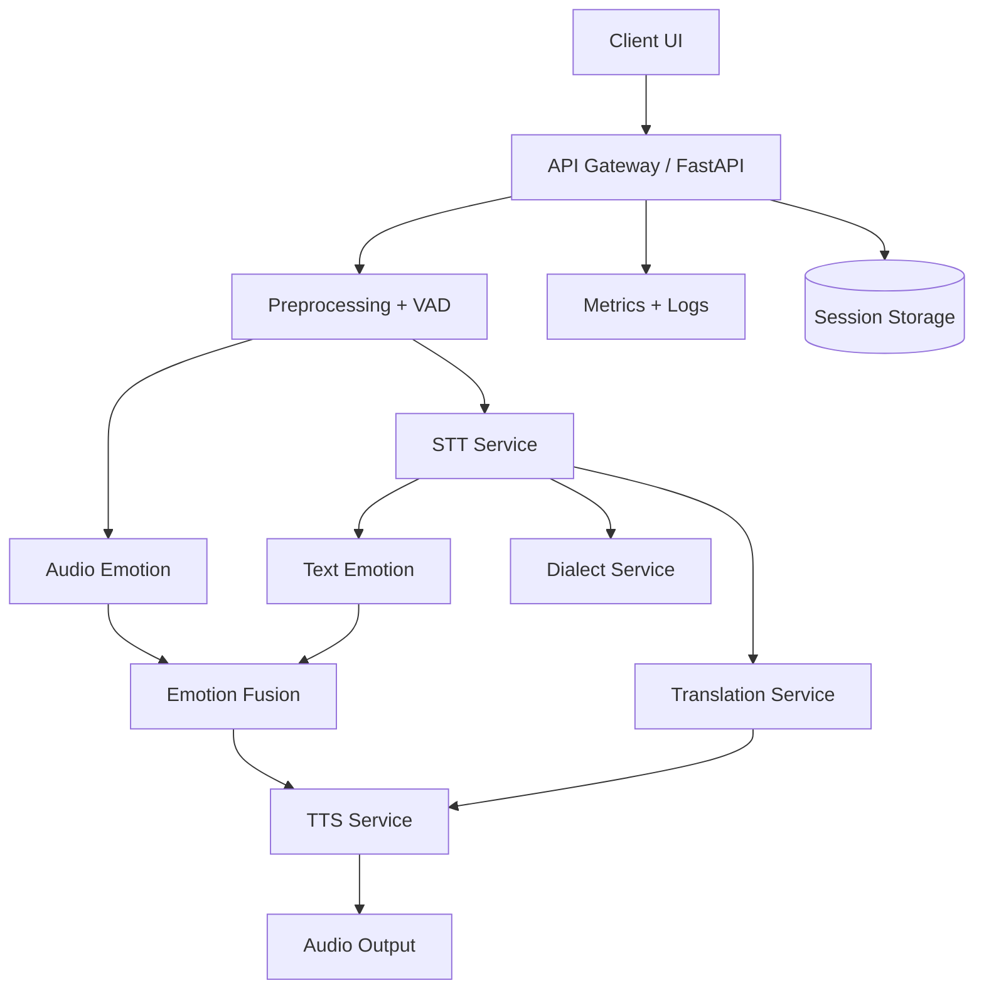

# EPMSSTS Production Readiness Plan

## Updated Architecture Diagram


## API Schema Updates (Versioned)
All JSON responses now include a `meta` object with `schema_version` and observability details.

Example for `/translate/speech`:
```json
{
  "session_id": "...",
  "transcript": "...",
  "detected_language": "en",
  "detected_emotion": "neutral",
  "emotion_confidence": 0.62,
  "detected_dialect": "standard_telugu",
  "dialect_confidence": 1.0,
  "translated_text": "...",
  "audio_url": "/output/....wav",
  "latency_ms": 1420,
  "meta": {
    "schema_version": "1.1",
    "request_id": "...",
    "stage": "pipeline",
    "latency_ms": 1420,
    "confidence": 0.62,
    "fallback_used": false,
    "audio_metrics": {
      "duration_sec": 2.1,
      "peak": 0.91,
      "rms": 0.06,
      "clipped_ratio": 0.0,
      "speech_ratio": 0.72
    },
    "stage_latencies_ms": {
      "stt_emotion": 640,
      "translation": 180,
      "tts": 300
    },
    "stage_confidences": {
      "stt": null,
      "emotion": 0.62,
      "dialect": 1.0,
      "translation": null,
      "tts": null
    },
    "fallbacks": {
      "silence_short_circuit": false,
      "stt_fallback": false,
      "emotion_fallback": false,
      "dialect_fallback": false,
      "translation_retry": false,
      "tts_fallback": false
    },
    "pipeline_confidence": 0.62
  }
}
```

## Monitoring Plan
- Prometheus metrics endpoint: `/metrics`.
- Metrics collected:
  - Request count and latency.
  - Stage latency histograms.
  - Stage error counts.
  - Stage retries and fallback usage.
  - Silence rejection counts.
  - Throttling counts.
- Grafana dashboards:
  - Per-stage latency heatmaps.
  - Error and fallback rates by stage.
  - Throughput and concurrency trends.

## Structured Logging Plan
- JSON logs per request and stage:
  - request_id, stage_name, latency_ms, confidence, fallback_used, error_type.
- Supports end-to-end traceability for every pipeline execution.

## Deployment Strategy
- Dockerized API service with optional GPU support.
- Horizontal scaling behind a load balancer.
- Separate worker pool for heavy inference if traffic spikes.
- Kubernetes readiness:
  - Liveness and readiness probes on `/health`.
  - HPA based on CPU/GPU metrics.

## Scalability Improvements
- Throttling using async semaphore for pipeline endpoints.
- Controlled queue timeouts for overload protection.
- Parallel STT + emotion execution for lower latency.
- Clear per-stage timeouts to avoid long tail latency.

## Observability Integration Plan
- Prometheus scrape of `/metrics`.
- Structured JSON logs forwarded to ELK/Cloud Logging.
- Alerts on:
  - Error spikes.
  - Latency p95/p99 drift.
  - Fallback usage > threshold.
  - Silence rejection rate anomalies.

## Streaming Readiness
- Current design supports future streaming by:
  - Isolating preprocessing, STT, translation, and TTS as composable stages.
  - Stage latency telemetry already captured.
  - The API can add WebSocket streaming for partial transcripts.
- Future addition:
  - `/stream/stt` for partial transcripts.
  - `/stream/translate` for incremental translation.
  - `/stream/speech` for low-latency audio updates.

## Testing Expansion
- Confidence regression tests across multilingual and emotional samples.
- Load tests targeting pipeline concurrency limits.
- Latency benchmarks per stage with p95/p99 tracking.
- Failure recovery tests (forced timeouts and model fallback).
- Streaming tests (planned for WebSocket endpoints).
