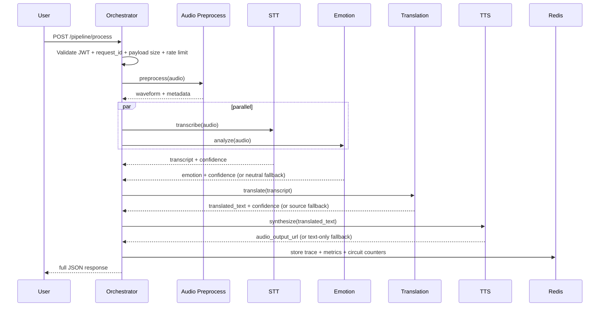

# Module 6: Production-Grade Orchestration Layer (Control Plane)

## Overview

The Orchestration Service v2 is the control plane for EPMSSTS speech-to-speech execution:

- Coordinates all AI stages asynchronously
- Enforces per-stage and end-to-end SLA
- Applies retries and stage-specific fallback policies
- Isolates failures with circuit breakers
- Preserves full request traceability
- Emits production observability metrics
- Supports stateless horizontal scaling with Redis-backed state
- Is designed to evolve into streaming mode without architectural rewrite

## Architecture Diagram

```mermaid
flowchart LR
    A[Client] --> B[POST /pipeline/process]
    B --> C[Security Guard\nJWT + Rate Limit + Payload Guard]
    C --> D[Orchestrator Core]
    D --> E[Audio Preprocessing]
    E --> F[Parallel Branch]
    F --> G[STT]
    F --> H[Emotion]
    G --> I[Translation]
    H --> I
    I --> J[TTS]
    J --> K[Pipeline Response]

    D -. traces .-> L[(Redis Trace Store)]
    D -. metrics .-> M[/pipeline/metrics]
    D -. circuit state .-> N[(Redis Circuit State)]
```

## Sequence Diagram



## SLA Matrix

| Stage | Timeout (Hard) | Target p95 | Breach Handling |
|---|---:|---:|---|
| Audio Preprocessing | 900 ms | 700 ms | mark degraded/failed + log breach |
| STT | 1700 ms | 1200 ms | **critical** → fail pipeline |
| Emotion | 1200 ms | 900 ms | neutral fallback + degraded |
| Translation | 1500 ms | 1000 ms | retry once, then source text fallback |
| TTS | 2000 ms | 1500 ms | retry once, fallback TTS, then text-only |
| End-to-End Pipeline | 5000 ms | 5000 ms | mark response degraded + increment SLA breach counter |

## Confidence Aggregation Logic

Stage confidence signals:

- STT confidence
- Emotion confidence
- Translation confidence
- TTS waveform validation confidence

Weighted final confidence:

$$
C_{system}=0.35\cdot C_{stt}+0.15\cdot C_{emotion}+0.30\cdot C_{translation}+0.20\cdot C_{tts}
$$

Uncertainty policy:

- `uncertainty_flag = true` when `system_confidence < 0.55`
- If uncertainty is high while pipeline is otherwise successful, final status is promoted to `degraded`

## Circuit Breaker Design

Each stage has an independent circuit breaker:

- States: `closed -> open -> half_open -> closed`
- Open trigger: repeated failures over threshold
- Open behavior: short-circuit stage and route to fallback immediately
- Half-open behavior: permit limited probe calls
- Recovery: close circuit after successful probes

Distributed storage:

- Circuit state stored in Redis keys
- Failure counters stored in Redis with TTL
- Prevents cascading failure storms across replicas

## Observability Dashboard Spec

Expose metrics via `GET /pipeline/metrics` and Prometheus scraping:

- `pipeline_latency_histogram`
- `stage_failure_rate`
- `stage_retry_rate`
- `degraded_response_rate`
- `confidence_distribution`
- `sla_breach_count`
- `requests_total`

Operational endpoints:

- `GET /pipeline/health`
- `GET /pipeline/status`
- `GET /pipeline/trace/{request_id}`

## Failure Mode Table

| Stage | Failure Type | Impact | Fallback | Status Returned |
|---|---|---|---|---|
| Audio Preprocessing | Timeout | No usable waveform | None | Failed |
| STT | Model crash | No transcript | Abort pipeline | Failed |
| Emotion | Empty/low confidence output | Emotion uncertain | Neutral fallback | Degraded |
| Translation | Empty output / low confidence | Translation quality degraded | Retry once, then source text | Degraded |
| TTS | GPU unavailable | Audio generation blocked | Retry + fallback TTS + text-only | Degraded |
| TTS | Memory exhaustion | Synthesis interrupted | Retry + fallback chain | Degraded |

## Security and Guards

Implemented controls:

- JWT validation dependency for `/pipeline/process`
- Rate limiting (Redis-backed token bucket style)
- Payload size guard (`audio_file` bounded)
- Request ID enforcement
- Timeout guard at route + per-stage timeout in service

## Scalability Strategy

- Stateless orchestrator replicas behind load balancer
- Redis used for cross-instance traces and circuit state
- No required in-memory global state for correctness
- Async non-blocking execution and controlled concurrency semaphore
- Streaming-ready abstraction via stage client interface

## Streaming-Ready Extension Path

Current architecture already supports incremental extension:

- Replace stage callables with stream-aware adapters
- Add WebSocket route that reuses orchestrator stage policy engine
- Emit partial STT, emotion updates, partial translation, progressive TTS chunks
- Reuse circuit breaker, tracing, and confidence propagation components

## Deployment Guide (Docker + Kubernetes)

### Docker

- Build image from project root Dockerfile
- Set environment variables:
  - `EPMSSTS_ORCH_AUTH_ENABLED=true`
  - `EPMSSTS_ORCH_JWT_SECRET=<secret>`
  - `REDIS_URL=redis://redis:6379`

### Kubernetes

Recommended topology:

- `Deployment` for API pods (2+ replicas)
- `Service` for API
- External or in-cluster Redis
- HPA based on CPU + latency SLO alerts
- Liveness: `/health` (global API)
- Readiness: `/pipeline/health`

## API Contract

`POST /pipeline/process`

Input:

```json
{
  "audio_file": "<base64>",
  "target_language": "en",
  "request_id": "uuid-like-id"
}
```

Output:

```json
{
  "status": "success | degraded | failed",
  "transcript": "...",
  "emotion": "...",
  "translation": "...",
  "audio_output_url": "...",
  "confidence_summary": {"...": "..."},
  "stage_latencies": {"...": 0.0},
  "total_latency_ms": 0.0,
  "request_trace_id": "..."
}
```

The response model is strict and always complete (no partial JSON envelope).
